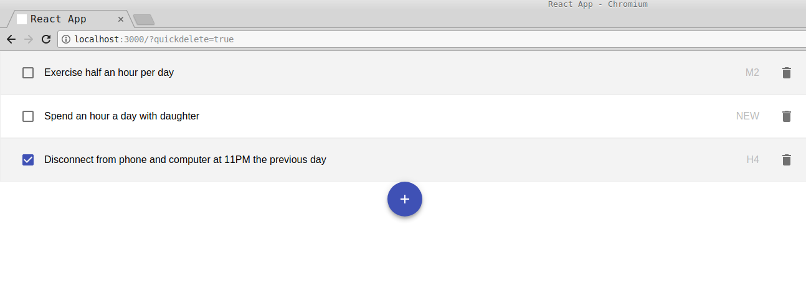

# What is it?
I have some habits I want to get into, I simply want to keep a record of on which days I actually
keep the habits (**HIT**), and the days I forget them (**MISS**).

I haven't found a good website/smart phone app that does this in a minimalistic way that pleases me.
So I made my own.

# Tech stack

    - Data layer
    |
    +---- MongoDB
    |
    - RESTful API layer
    |
    +---- Node.js
    +---- express
    |
    - Front-end
    |
    +---- React.js
    +---- create-react-app
    +---- redux
    +---- recompose
    +---- react-router-dom
    +---- styled-components

# How to run?
- `cd server/; yarn`
    - you do this once
- `cd client/; yarn`
    - you do this once
- `cd server/; yarn start`
    - this runs MongoDB and API server
- `cd client/; yarn start`
    - this runs React dev server
- open up `localhost:3000` in your browser

# Screenshot

